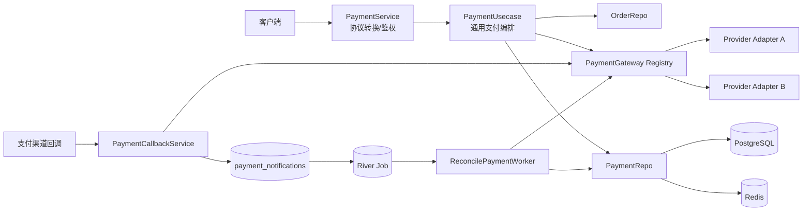

# 电商系统正确性与支付解耦修复方案

> 历史修复计划与验证记录，不作为当前 API、Schema 或配置契约。当前事实请以 [订单与支付实现状态](payment-feature-implementation-status.md)、[业务时序](payment-business-flow.md)、proto 与 `000001_init_schema` 为准。

## 1. 文档状态

- 状态：已实施并验证（2026-07-15）
- 适用服务：`app/mall`
- 目标框架：Go Kratos
- 主要范围：订单、支付、River 任务、Redis 缓存、鉴权与资源授权
- 非目标：不维护微信支付 provider 内部协议实现；只保证微信等渠道可以通过统一、可选的支付适配器接入

本文针对当前代码审查发现的正确性问题给出落地方案。实施顺序以“先阻断资金风险，再恢复业务完整性，最后完成结构解耦”为原则。

## 2. 当前基线

当前工程已经具备以下基础：

- Kratos HTTP/gRPC 服务和 Wire 依赖注入；
- PostgreSQL + sqlc 数据访问；
- Redis + `singleflight` 读缓存；
- River PostgreSQL 任务队列；
- `PaymentAdapter` / `PaymentGateway` 支付渠道接口；
- 支付与订单更新后的 `afterCommit` 缓存失效机制。

但当前基线不能用于真实交易：

- 客户端传入的支付金额会被直接发送到渠道；
- 支付回调被 JWT 中间件保护，渠道服务器无法正常调用；
- 支付状态更新没有条件约束，并发情况下可以覆盖既有终态；
- River 任务完成后的默认去重会吞掉晚到支付通知；
- 订单与退款接口存在“返回成功但未执行”的空实现；
- 多个分页缓存没有写后失效；
- 已认证用户之间缺少资源所有权隔离；

当前验证基线：

- `go vet ./...` 通过；
- `go test ./...` 为 143 通过、2 失败；
- 两个失败用例均为 `PaymentRepo_ClosePayment` 的 mock 未声明新增的 `GetOrder` 调用；
- race 测试受当前 Go 工具链 `runtime/race` 缺失影响，尚未形成有效基线。

## 3. 必须长期成立的业务不变量

后续实现和测试必须围绕以下不变量展开：

1. 支付金额、币种和订单归属只能来自服务端数据库，不能信任客户端请求或渠道回调中的单一字段。
2. 同一个商户支付号只能确定地定位到一笔本地支付流水。
3. 支付和订单状态只能沿允许的方向迁移，任何终态更新都必须幂等。
4. 渠道通知只有在被可靠持久化后才能返回成功确认。
5. 数据库事务中不得执行第三方网络请求。
6. 业务 pending、技术重试和最终失败必须分开建模。
7. 缓存可以暂时不可用，但不能突破资源所有权，也不能在写成功后长期返回旧数据。
8. 缺少某个支付 provider 的配置不能阻止其他 provider 或非支付功能启动。
9. service 层不得出现具体 provider 的编排分支；provider 差异只能存在于 adapter 边界。
10. 未实现的 API 必须返回明确错误，禁止返回伪成功。

## 4. 目标支付架构



关键边界：

- `service`：解析 proto、读取 claims、做输入校验和错误映射，不判断微信/支付宝；
- `biz`：金额可信边界、状态机、所有权、支付编排和重试策略；
- `data`：CAS SQL、事务、River 入队、缓存失效和 provider adapter；
- `server`：路由、中间件和公开回调路径；
- provider adapter：验签、字段映射、渠道 API 调用、渠道结果到统一结果的转换。

## 5. 分阶段实施计划

### Phase 0：资金安全热修复

这一阶段应单独发布，不等待整体重构。
!! 当前没有旧数据，且还未做客户端

#### 5.1 服务端接管支付金额

涉及文件：

- `api/payment/v1/payment.proto`
- `app/mall/internal/service/payment.go`
- `app/mall/internal/biz/payment.go`
- `app/mall/internal/job/river.go`
- `app/mall/internal/data/payment.go`

改动：

1. 将 `CreatePaymentReq.total_amount` 标记为 deprecated。
2. `PrepayForOrder` 从订单读取金额，并把 `order.TotalAmount` 同时用于本地 payment 和 provider prepay。
3. description 为空时由服务端根据订单生成安全兜底值。
4. `ApplyPayQuery` 更新成功状态前加载 payment，校验：
   - `result.OutTradeNo == payment.OutTradeNo`；
   - `NormalizePayChannel(result.Channel) == payment.PayChannel`；
   - `result.TotalAmount == payment.Amount`；
   - transaction ID 非空且满足渠道约束。
5. 金额不一致时不更新订单，记录 `payment_reconcile_required` 事件并触发告警。

建议逐步把所有金额统一为最小货币单位：

```go
type Money struct {
    Amount   int64  // 分
    Currency string // CNY
}
```

禁止在核心业务中混用 `float64`、表示“元”的 decimal 和表示“分”的整数。数据库最终统一为 `BIGINT amount_minor` + `VARCHAR currency`; 当前没有旧数据。

验收用例：

- 订单 10000 分、请求传 1 分，adapter 必须收到 10000；
- 请求不传金额，adapter 仍收到订单金额；
- 渠道查询返回 1 分时，payment/order 均不进入成功态；
- 金额不匹配产生结构化日志、指标和待对账记录。

#### 5.2 放开回调路由，但不放松验签

涉及文件：

- `app/mall/internal/server/http.go`
- `app/mall/internal/service/payment.go`
- `app/mall/internal/server/middleware/*`

改动：

1. 将支付回调 operation 加入 JWT selector 的跳过集合，或为回调建立独立公开 Router。
2. 公开只表示“不需要用户 JWT”，不表示信任请求；回调必须经过 provider adapter 验签。
3. 验签配置缺失时 fail closed，返回失败，不允许跳过验签。
4. 加入请求体大小限制、provider 维度限流、超时和结构化审计日志。
5. HTTP/gRPC 业务 API 继续使用 JWT；只开放回调路径。

推荐将回调路由统一成：

```text
POST /v1/payments/{provider}/notify
```

兼容期保留现有 provider 路径，并转发到统一 callback service。

验收用例：

- 不携带 JWT 的合法渠道回调可以到达 handler；
- 普通匿名请求仍不能访问支付查询、关单和管理 API；
- 缺失签名、错误签名、缺失验签配置全部失败；
- 回调错误不会被 Kratos JSON error encoder 改写成渠道无法识别的确认格式。

#### 5.3 修复支付宝统一返回动作

当前 adapter 写 `PayURL`，service 读取 `CodeURL`。不应只做字段名修补，应直接移除 provider 专属返回字段。

统一模型：

```go
type PaymentActionType string

const (
    PaymentActionRedirect PaymentActionType = "redirect"
    PaymentActionForm     PaymentActionType = "form"
    PaymentActionInvoke   PaymentActionType = "invoke"
)

type PaymentAction struct {
    Type    PaymentActionType
    Payload json.RawMessage
}

type PaymentPrepayResult struct {
    ProviderReference string
    Action            PaymentAction
}
```

adapter 负责生成前端动作；service 只透传 `Action.Type` 和 `Action.Payload`。支付宝 WAP、APP 必须成为不同 method，不能都调用 WAP API。

验收用例：

- 支付宝 WAP 返回非空 redirect URL；
- 支付宝 APP 返回适合 SDK 的 invoke payload，而不是 WAP URL；
- service 测试使用真实 adapter result contract，防止 DTO 字段错配。

#### 5.4 停止伪成功 API

在订单和退款完整实现前：

- `OrderService` 的空实现统一返回 `codes.Unimplemented` / Kratos `NotImplemented` 错误；
- `RefundPayment` 返回明确未实现错误；
- 不返回空对象和 HTTP 200；
- OpenAPI 文档标注暂不可用。

### Phase 1：支付与订单状态机

#### 5.5 建立明确状态和迁移规则

建议支付状态：

```text
creating -> pending -> success -> refunded
                   \-> close_pending -> closed
                   \-> reconcile_required
```

建议订单状态：

```text
creating -> pending_payment -> paid -> shipped -> completed
                         \-> cancelling -> cancelled
```

规则：

| 当前状态 | 事件 | 允许结果 |
|---|---|---|
| pending | provider success | success |
| pending | close confirmed | closed |
| pending | poll timeout | close_pending，不直接 failed |
| success | duplicate success | 保持 success，幂等成功 |
| success | close/fail | 拒绝并告警 |
| closed | late success | reconcile_required，不自动完成已取消订单 |
| success | refund confirmed | refunded |
| refunded | success/fail | 拒绝 |

“支付成功但订单已取消”不能简单把订单改回 completed，因为库存可能已经释放。应进入 `reconcile_required`，由自动退款或人工对账处理。

#### 5.6 SQL 使用 CAS，而不是无条件 UPDATE

sqlc 查询示例：

```sql
-- name: MarkPaymentSuccess :one
UPDATE payments
SET status = 'success',
    third_party_tx_id = $2,
    paid_at = $3,
    updated_at = CURRENT_TIMESTAMP
WHERE id = $1 AND status = 'pending'
RETURNING *;

-- name: MarkPaymentClosed :one
UPDATE payments
SET status = 'closed', updated_at = CURRENT_TIMESTAMP
WHERE id = $1 AND status IN ('pending', 'close_pending')
RETURNING *;
```

CAS 返回 `pgx.ErrNoRows` 时，必须重新读取当前状态：

- 已经是目标状态：返回幂等成功；
- 已经是其他终态：返回 `PAYMENT_STATE_CONFLICT` 并告警；
- 记录 `from_state`、`event`、`to_state` 和 provider reference。

订单 complete/cancel 同样使用条件更新，不能相互覆盖。

#### 5.7 修正查询唯一性

推荐决策：`out_trade_no` 在本系统全局唯一，而不是只在 provider 内唯一。原因是现有回调和大量内部接口只携带 `out_trade_no`。

迁移步骤：

1. 检查并处理已有跨渠道重复数据；
2. 建立全局唯一索引 `UNIQUE(out_trade_no) WHERE out_trade_no IS NOT NULL`；
3. `GetPaymentByOutTradeNo` 返回唯一记录，不再使用无序 `LIMIT 1`；
4. 如果业务必须允许跨渠道重复，则所有 repo、cache key、River unique key 和回调查询都必须同时携带 `provider/channel`。

`GetPaymentByOrder` 改为显式语义：

- `GetActivePaymentByOrderMethod`：只返回 pending/success，按创建时间倒序；
- `GetLatestPaymentByOrder`：所有状态按 `created_at DESC, id DESC`；
- 禁止继续使用无排序的单行查询。

#### 5.8 事务中移除第三方网络调用

当前 `PrepayForOrderWithCheckJob` 在数据库事务中调用 provider。调整为 saga：

1. 短事务创建/复用 payment，状态为 `creating`；
2. 提交事务；
3. 使用固定 `out_trade_no` 调 provider prepay；
4. 短事务把 payment 改为 `pending`，保存可安全重放的 action，并按 adapter capability 入队；
5. 第 4 步失败时，重试仍复用同一 payment/out_trade_no，并通过 provider 幂等语义恢复；
6. 不允许因本地 MQ 失败回滚已经发生的第三方调用。

### Phase 2：可靠回调与 River 任务

#### 5.9 增加 callback inbox

新增 `payment_notifications`：

```sql
CREATE TABLE payment_notifications (
    id BIGINT GENERATED ALWAYS AS IDENTITY PRIMARY KEY,
    provider VARCHAR(32) NOT NULL,
    provider_event_id VARCHAR(128),
    out_trade_no VARCHAR(64) NOT NULL,
    payload_hash VARCHAR(64) NOT NULL,
    verified_at TIMESTAMPTZ NOT NULL,
    processed_at TIMESTAMPTZ,
    status VARCHAR(20) NOT NULL DEFAULT 'received',
    last_error TEXT,
    created_at TIMESTAMPTZ NOT NULL DEFAULT CURRENT_TIMESTAMP
);

CREATE UNIQUE INDEX idx_payment_notifications_event
ON payment_notifications(provider, provider_event_id)
WHERE provider_event_id IS NOT NULL;

CREATE UNIQUE INDEX idx_payment_notifications_payload
ON payment_notifications(provider, out_trade_no, payload_hash);
```

处理流程：

1. adapter 验签并解析为统一 `PaymentNotification`；
2. PostgreSQL 事务内插入 inbox；
3. 同一事务使用 River `InsertTx` 入队 reconciliation job；
4. 事务提交后才返回 provider success；
5. 唯一冲突表示重复通知，可以安全返回 success；
6. 事务或入队失败时返回 provider failure，让渠道按协议重试。

不要把未经脱敏的完整回调正文写入普通日志。若审计需要保存原文，应加密存储并设置保留期限。

#### 5.10 分离轮询次数和技术重试

当前 `MaxAttempts = MaxPolls` 把网络错误和业务 pending 混在一起。调整为：

- `poll_count`：业务查询次数；
- River `MaxAttempts`：单次任务的技术失败重试次数；
- provider 返回 pending：使用 snooze/重新调度并增加 `poll_count`；
- 网络、超时、限流：作为技术错误重试，不增加业务 poll count；
- 达到业务截止时间：先进入 `close_pending`，调用支持关单的 adapter；
- provider 明确 closed 后才能把本地 payment/order 关闭。

任务参数建议：

```go
type ReconcilePaymentArgs struct {
    PaymentID  int64  `json:"payment_id" river:"unique"`
    Provider   string `json:"provider" river:"unique"`
    Trigger    string `json:"trigger"`
    PollCount  int    `json:"poll_count"`
}
```

唯一性只覆盖活跃状态，不覆盖 completed：

```go
UniqueOpts: river.UniqueOpts{
    ByArgs:  true,
    ByQueue: true,
    ByState: []rivertype.JobState{
        rivertype.JobStateAvailable,
        rivertype.JobStatePending,
        rivertype.JobStateRunning,
        rivertype.JobStateRetryable,
        rivertype.JobStateScheduled,
    },
}
```

这样同一支付的并发任务会合并，但旧任务 completed 后，晚到回调仍可重新触发对账。

#### 5.11 增加任务最终失败处理

为 River 配置 `ErrorHandler` 或事件订阅：

- discarded/cancelled 任务写入 `payment_reconciliation_failures`；
- payment 进入 `reconcile_required`，不能永久停留 pending；
- 记录 payment ID、provider、attempt、last error；
- 产生指标和告警；
- 提供安全的人工 redrive 命令/API，redrive 本身必须幂等并受管理员权限保护。

### Phase 3：缓存一致性

#### 5.12 使用 generation key 失效分页缓存

禁止在业务请求中使用 Redis `SCAN` 删除任意数量的分页 key。使用 generation：

```text
product:list:gen                              -> 17
product:list:17:{limit}:{offset}              -> payload
product:category:{category_id}:gen            -> 9
product:category:{category_id}:9:{limit}:{offset}
order:user:{user_id}:gen                      -> 12
order:user:{user_id}:12:{limit}:{offset}
```

写成功后的 `afterCommit` 回调只需 `INCR` 对应 generation。旧缓存自然按 TTL 淘汰。

具体要求：

- 商品创建：增加全局列表和目标分类 generation；
- 商品换分类：增加全局、旧分类、新分类 generation；
- 商品库存/状态/删除：增加全局和所属分类 generation；
- 订单创建、状态变化、取消、支付完成：增加该用户订单 generation 和 ongoing generation；
- Event 现有 `SCAN event:list:*` 也迁移到 generation；
- generation key 不设置短 TTL，数据 key 保留抖动 TTL。

#### 5.13 修复地址缓存所有权与事务

1. 地址详情 key 改为 `shipping_addr:user:{user_id}:{address_id}`；
2. 即使缓存命中，也断言 `cached.UserID == requestedUserID`；
3. not found 返回明确 `ErrShippingAddressNotFound`，禁止在 `any` 中返回错误类型的 typed nil；
4. `ClearDefaultShippingAddress + SetDefaultShippingAddress` 放入同一事务；
5. 更新默认地址后失效：用户地址列表、旧默认详情、新默认详情；
6. 数据库增加每用户最多一个默认地址的唯一约束：

```sql
CREATE UNIQUE INDEX idx_shipping_addresses_one_default
ON shipping_addresses(user_id)
WHERE is_default = TRUE;
```

#### 5.14 缓存中移除敏感字段

当前 user cache 会序列化完整 `biz.User`。拆分：

- profile cache：只缓存 ID、昵称、实名展示字段、角色和时间；
- 登录查询：从数据库读取 password hash，或使用独立、最小化、短 TTL 的 auth record；
- 不在通用 Redis cache 中保存 `PasswordHash`、`PhoneEncrypt`；
- Redis `Set` 错误需要记录指标；缓存失败不应导致主业务失败；
- `NewRedisClient` 必须实际使用配置中的 network/read timeout/write timeout。

### Phase 4：资源授权与订单实现

#### 5.15 建立统一资源授权

认证与授权分离：JWT 中间件只证明“是谁”，biz/service 还必须判断“能否操作该资源”。

建议策略：

| API | 授权规则 |
|---|---|
| 用户查询/修改/删除 | claims.UserID == resource user ID，管理员例外 |
| 地址 CRUD | claims.UserID == address.UserID |
| 订单查询/取消 | claims.UserID == order.UserID |
| 支付查询/关单/退款 | claims.UserID == payment.UserID；关单/退款可进一步限制角色 |
| 商品/分类/活动写操作 | role == admin |
| 商品/分类/活动读操作 | 按产品策略公开或仅认证 |
| MQ job 查询/redrive | admin 或内部服务身份 |

落地方式：

- service 从 `ClaimsFromContext` 获取 user ID，不再信任 body/path 中的 `user_id`；
- 兼容期若请求仍携带 `user_id`，必须与 claims 一致；
- repo 查询尽量使用 `(resource_id, user_id)`，形成第二道防线；
- 使用 Kratos error reason 统一返回 `UNAUTHORIZED`、`FORBIDDEN`、`NOT_FOUND`，避免泄漏其他用户资源是否存在；
- 为管理 RPC 增加 role middleware 或 service 层策略对象。

#### 5.16 完整实现订单，而不是转发客户端金额

`CreateOrderRequest.items` 是订单金额的唯一客户端输入之一；客户端不能提交总金额、商品名称或成交价。

创建订单事务：

1. 从 claims 获取 user ID；
2. 校验地址属于该用户；
3. 加载所有商品并校验可售状态；
4. 使用数据库当前价格计算订单总额；
5. 原子扣减库存，库存不足整体回滚；
6. 创建 order；
7. 创建带商品名称、封面、单价快照的 order items；
8. 生成全局唯一 `order_no/out_trade_no`；
9. 提交后失效订单和商品缓存。

建议把 `order_items` 增加 `product_name_snapshot`、`cover_image_snapshot`，避免历史订单展示受商品更新影响。

取消订单事务：

- 只允许订单所有者或管理员；
- 只允许可取消状态；
- 若已有 success payment，不允许直接取消，应进入退款流程；
- 恢复库存必须幂等，建议通过库存流水或唯一业务事件约束；
- 状态更新、库存恢复和任务入队必须在同一 PostgreSQL 事务中完成。

### Phase 5：Payment-agnostic 收敛

#### 5.17 重塑 provider-neutral 接口

建议领域模型：

```go
type PaymentMethod struct {
    Provider string // alipay, wechat, ...
    Product  string // wap, app, native, jsapi, ...
}

type PaymentCapabilities struct {
    SupportsNotify bool
    RequiresPoll   bool
    SupportsClose  bool
    SupportsRefund bool
}

type PaymentAdapter interface {
    Provider() string
    Supports(method PaymentMethod) bool
    Capabilities(method PaymentMethod) PaymentCapabilities
    Prepay(context.Context, PaymentPrepayRequest) (*PaymentPrepayResult, error)
    Query(context.Context, PaymentQueryRequest) (*PaymentQueryResult, error)
    Close(context.Context, PaymentCloseRequest) (*PaymentCloseResult, error)
    ParseAndVerifyNotification(*http.Request) (*PaymentNotification, error)
}
```

约束：

- biz DTO 不出现 `OpenID`、`PrepayID`、`CodeURL`、`PayURL` 等 provider 专属字段；
- provider 专属参数只存在于 adapter 输入的扩展对象，并由 adapter 自己校验；
- service 不判断 `biz.Wechat` / `biz.Alipay`；
- 是否入队由 `Capabilities.RequiresPoll` 决定；
- 关闭和退款能力由 capabilities 决定，未支持时返回明确错误；
- 删除空 channel 自动默认到微信/支付宝的逻辑，必须显式选择 method。

#### 5.18 provider 可选注册

将当前固定构造两个 adapter 的 `NewPaymentAdapters` 改为配置驱动：

```go
func NewPaymentAdapters(c *conf.Payment, logger log.Logger) ([]biz.PaymentAdapter, error)
```

规则：

- provider 配置完全缺失：不注册，不报错；
- provider 显式 enabled 但配置不完整：启动失败；
- 至少一个 provider 注册并不是整个商城启动的必要条件；
- 没有可用 provider 时，支付 API 返回 `PAYMENT_PROVIDER_NOT_AVAILABLE`，商品、用户、订单 API 仍可启动；
- 新增 provider 只需新增 adapter 和注册配置，不修改 service/biz 编排。

#### 5.19 清理 provider 专属公共接口

- 新增通用 `CreatePaymentCheckJob`，参数使用 `payment_id`，provider 从 payment 读取；
- `CreateWechatPayCheckJob` 标记 deprecated，兼容期内部转发到通用接口；
- 后续主版本删除 provider 专属 RPC；
- 回调可保留 provider 路径，但统一进入 registry + callback service；
- 微信 provider 内部实现保持非维护状态，只需满足新的 adapter contract 或在未配置时不注册。

### Phase 6：配置、安全与可观测性

#### 5.20 秘钥迁移

- 移除仓库中的固定 access/refresh/phone secret；
- 使用环境变量、Kubernetes Secret 或配置中心；
- 立即轮换已经提交过的 secret；
- 启动时校验 secret 长度和空值；
- 日志过滤 token、手机号、回调签名和 provider 密钥。

#### 5.21 Kratos 中间件补齐

HTTP/gRPC 建议统一包含：

- `recovery.Recovery()`；
- `tracing.Server()`；
- `logging.Server()`，带敏感字段过滤；
- `validate.Validator()`；
- JWT + claims 注入；
- 资源/角色授权；
- 支付与登录接口的限流；
- provider client 的 tracing、timeout、retry/circuit breaker 策略。

支付外部调用不能沿用当前 1 秒 server timeout。应设置独立 provider timeout，并保证客户端超时后的请求可以通过固定幂等键安全恢复。

#### 5.22 指标与告警

至少增加：

```text
payment_state_transition_total{from,to,event,provider}
payment_state_conflict_total{provider}
payment_amount_mismatch_total{provider}
payment_callback_total{provider,result}
payment_callback_persist_failure_total{provider}
payment_reconcile_job_total{provider,result}
payment_reconcile_required_total{provider}
river_job_discarded_total{kind}
cache_operation_failure_total{operation,entity}
authorization_denied_total{operation,reason}
```

告警：

- 任意金额不匹配立即告警；
- `reconcile_required` 非零告警；
- callback 持久化失败持续 1 分钟告警；
- River discarded 增长告警；
- success payment 对应非 paid/completed 订单告警；
- closed/failed payment 对应 completed 订单告警。

## 6. 文件级改动清单

| 文件/目录 | 主要改动 |
|---|---|
| `api/payment/v1/payment.proto` | 废弃客户端金额；增加通用 method/action/job API；补充校验规则 |
| `api/order/v1/order.proto` | claims 驱动 user ID；完善分页和订单项契约 |
| `app/mall/internal/service/payment.go` | 删除 provider 分支；修复回调确认；统一 action 透传 |
| `app/mall/internal/service/order.go` | 实现 DTO 转换、claims 和错误映射 |
| `app/mall/internal/service/user.go` | 所有权校验；登录同时签发 refresh token |
| `app/mall/internal/biz/payment.go` | 金额可信边界、状态机、capabilities、通用编排 |
| `app/mall/internal/biz/order.go` | 实现订单创建/查询/取消用例 |
| `app/mall/internal/data/payment.go` | CAS 更新、唯一查询、adapter contract、缓存失效 |
| `app/mall/internal/data/order.go` | 条件状态更新、分页 generation 缓存 |
| `app/mall/internal/data/product.go` | 商品列表 generation 缓存 |
| `app/mall/internal/data/event.go` | 用 generation 替代 SCAN |
| `app/mall/internal/data/user.go` | 地址 owner-aware key、默认地址事务、敏感缓存拆分 |
| `app/mall/internal/job/river.go` | 业务 poll 与技术 retry 分离；终态处理 |
| `app/mall/internal/server/http.go` | 回调公开路由、授权 selector、限流 |
| `app/mall/internal/data/data.go` | provider 可选注册、Redis timeout、River ErrorHandler |
| `app/mall/db/migrations/*` | 状态约束、金额单位、唯一索引、callback inbox、默认地址唯一索引 |
| `app/mall/db/query/*` | CAS SQL、明确查询语义、所有权查询 |
| `app/mall/cmd/mall/wire*.go` | 重新生成可选 adapter 和新增组件的依赖注入 |

生成文件必须通过项目 Makefile/Wire/protoc 命令重新生成，禁止手改 `*.pb.go`、sqlc 输出和 `wire_gen.go`。

## 7. 测试计划

### 7.1 单元测试

- amount tampering 和渠道返回金额不匹配；
- 每一条支付/订单状态迁移；
- 重复 success、重复 close、success 与 close 并发；
- late success 进入 reconcile，而不是覆盖 cancelled；
- adapter action contract；
- claims 与 path/body user ID 不一致；
- 缓存命中时的地址所有权；
- typed nil/not found 不 panic；
- generation 缓存键更新。

### 7.2 集成测试

使用真实 PostgreSQL + Redis/miniredis + River：

- callback inbox 与 River job 同事务提交/回滚；
- 重复回调只产生一个 inbox 记录和一个活跃 job；
- completed job 后晚到回调可以重新入队；
- River 技术重试耗尽后产生 reconciliation failure；
- CAS 更新在并发 goroutine 下只有一个成功迁移；
- 商品/订单写入后所有相关列表缓存失效；
- 默认地址切换不会出现两个默认地址。

### 7.3 API/E2E 测试

- 无 JWT 的 provider 回调可达，业务 API 不可达；
- 用户 A 不能读写用户 B 的地址、订单和支付；
- 普通用户不能写商品/分类/活动；
- 创建订单金额来自商品价格快照；
- 创建支付金额等于订单金额；
- provider success 最终只完成对应订单一次；
- 退款未实现阶段返回非 2xx，完成后验证退款状态机。

### 7.4 必须通过的命令

```bash
go generate ./...
go test ./...
go test -race ./...
go vet ./...
```

若 CI 使用 `staticcheck`，同时要求 `staticcheck ./...`。当前 race 工具链问题需要先在 CI 镜像中修复，不能长期作为跳过 race 的理由。

## 8. 发布与迁移顺序

> !!! 无历史数据和客户端，以下步骤可以不保留兼容性。

1. 立即修复服务端金额、回调白名单、回调失败确认、支付宝 action 和伪成功 API。
2. 发布仅增加字段/表/索引的向后兼容 migration。
3. 发布双读/双写状态机和 amount minor-unit 代码。
4. 回填历史数据，检查重复 out_trade_no 和非法状态。
5. 开启 CAS 状态更新与 callback inbox。
6. 切换 River uniqueness/retry 策略并观察 discarded、reconcile 指标。
7. 切换 generation cache。
8. 启用资源授权；上线前准备用户端 403/404 兼容处理。
9. 切换 provider-neutral action/capability contract。
10. 删除旧列、旧缓存键和 deprecated provider RPC。

每个阶段都必须支持回滚。数据库迁移先扩展后收缩；禁止在同一发布中同时删除旧字段并切换所有调用方。

## 9. 完成定义

修复只有同时满足以下条件才算完成：

- 客户端无法改变支付金额；
- 合法 callback 无需 JWT 且必须验签；
- callback 只有持久化成功后才确认；
- payment/order 不存在非法反向状态迁移；
- late success 有确定的对账或退款路径；
- River completed/discarded 不会永久吞掉后续有效通知；
- 所有订单 API 有真实实现，退款未实现时不返回成功；
- 商品、订单、地址缓存一致性用例全部通过；
- 所有用户资源和管理 API 有授权测试；
- 缺少任一 provider 配置时商城仍能启动；
- 新增 provider 不需要修改 `PaymentService` 或支付状态机；
- `go test ./...`、`go test -race ./...`、`go vet ./...` 全部通过；
- 生产监控可以发现金额不匹配、状态冲突、回调落库失败和任务 discarded。

## 10. 实施验证记录

本方案已按完成定义落地。最终验证使用当前工作区生成代码、真实 PostgreSQL 16、Redis 7、River 和 Docker Compose 可观测性组件完成。

- `make all`：通过，重新生成 protobuf/OpenAPI、配置、sqlc、mock 与 Wire，并完成 `go mod tidy`；
- `go generate ./...`：通过；
- `go test ./...`：通过；
- `go test -race ./...`：通过；
- `go vet ./...`：通过；
- `go build ./...`：通过；
- `go test -tags=integration ./app/mall/internal/data -run TestCorrectnessIntegration -count=1`：通过；
- `go test -race -tags=integration ./app/mall/internal/data -run TestCorrectnessIntegration -count=1`：通过；
- `docker compose config --quiet`：通过；
- `git diff --check`：通过。

真实集成套件覆盖 callback inbox 与 River 同事务提交/回滚、重复通知去重、completed 后晚到通知重新入队、并发支付 CAS、success/close 竞争、服务端商品定价和订单快照、相关缓存 generation、并发默认地址唯一约束，以及 River discarded 后对账失败落库与缓存失效。

使用 `payment: {}` 的配置启动当前二进制成功，HTTP/gRPC 正常监听，受保护支付接口在无 JWT 时返回 401，证明支付 provider 不是商城启动前置条件。无效 provider 回调按 fail-closed 处理。OTel Collector、Prometheus 与 Jaeger 的真实链路验证通过：trace 可在 Jaeger 查询，支付 callback 失败及持久化失败计数可由 Collector 导出并在 Prometheus 查询；金额不匹配、状态冲突、回调落库失败、待对账和 River discarded 告警规则均成功加载。
