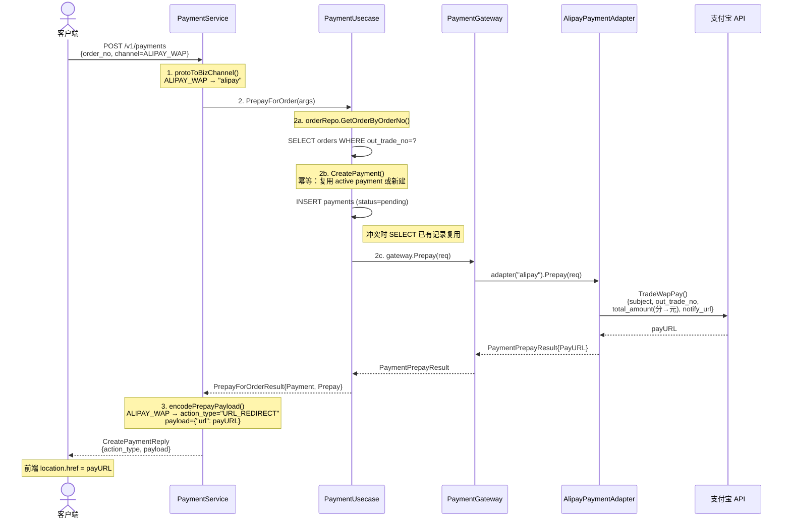
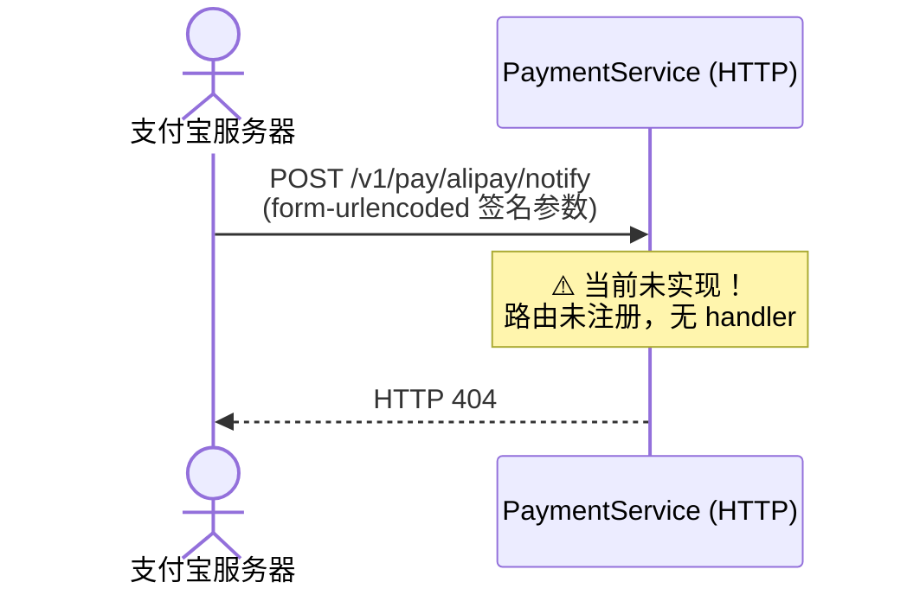
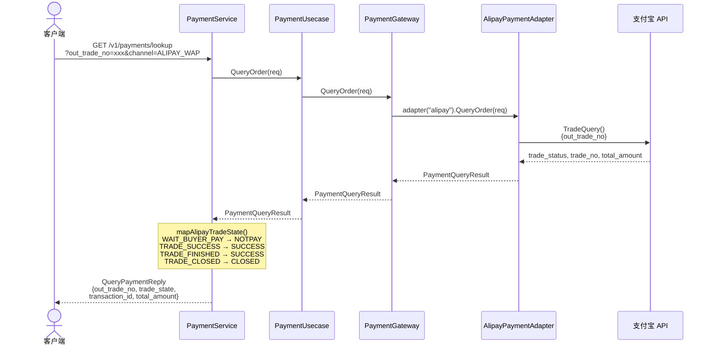
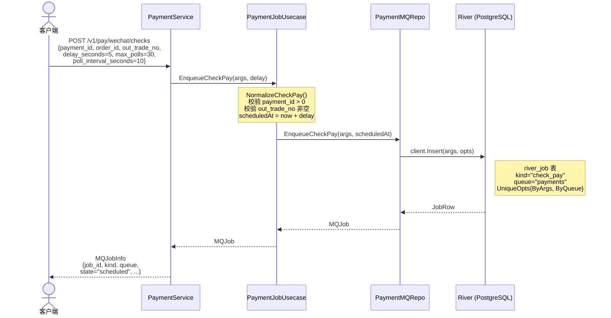
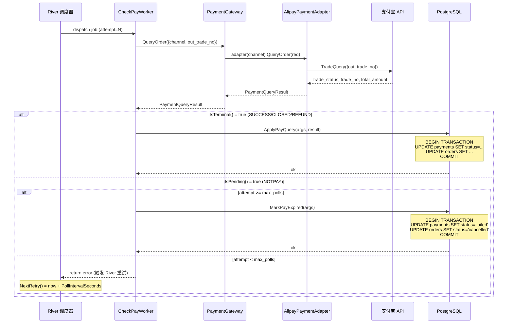
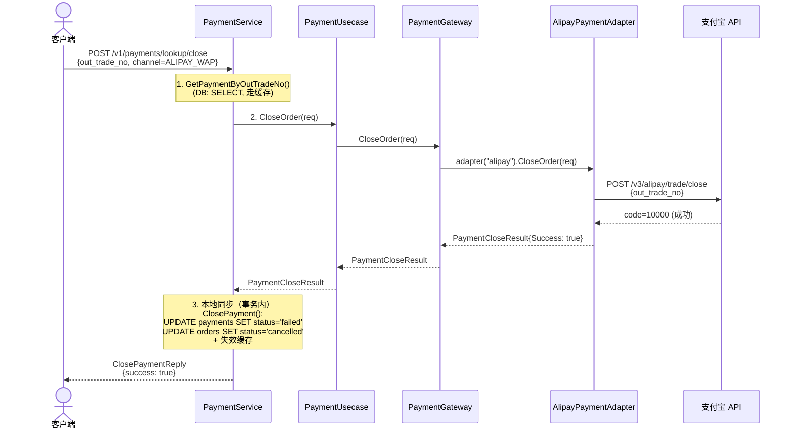

# 支付业务流程文档（以支付宝为例）

Date: 2026-07-07

## 概述

本文档以**支付宝手机网站支付（ALIPAY_WAP）**为例，完整梳理支付子系统的业务逻辑，涵盖各层级调用关系、数据库操作、缓存策略和消息队列使用。

**核心设计决策：**

- 支付读操作使用 **Redis + singleflight** 缓存，写操作通过 PostgreSQL 事务保证一致性。
- 异步轮询由 **River**（基于 PostgreSQL 的任务队列）驱动，无需独立消息中间件。
- 统一支付入口 `CreatePayment` 整合了微信/支付宝两个渠道，通过 `PayChannel` 枚举路由。
- 支付宝**没有**自动入队轮询任务（仅微信在 prepay 时自动入队），支付宝依赖回调 + 手动查询。

---

## 架构分层

```
┌─────────────────────────────────────────────────────────────────┐
│  Transport 层 (service/payment.go)                              │
│  PaymentService                                                 │
│  ─ CreatePayment     ← 统一支付入口                              │
│  ─ QueryPayment      ← 统一查询                                  │
│  ─ ClosePayment      ← 统一关闭                                  │
│  ─ HandleWechatPayNotify ← 微信回调（HTTP）                      │
│  ─ CreateWechatPayCheckJob ← 手动入队轮询                        │
│  ─ GetPayment / GetPaymentByOrder ← 查询流水                    │
├─────────────────────────────────────────────────────────────────┤
│  Biz 层 (biz/payment.go + biz/payment_gateway.go)               │
│  PaymentUsecase                                                 │
│  ─ PrepayForOrder         ← order_no → payment → prepay         │
│  ─ PrepayForOrderWithCheckJob ← 微信专用：prepay + 入队原子化    │
│  ─ QueryOrder / CloseOrder                                      │
│  ─ EnqueueWechatCheckJobByOutTradeNo ← 回调后入队               │
│                                                                 │
│  PaymentJobUsecase                                              │
│  ─ EnqueueCheckPay / EnqueueCheckPayTx                          │
│                                                                 │
│  PaymentGateway (路由器)                                         │
│  ─ 按 channel 分发到 WechatPaymentAdapter / AlipayPaymentAdapter │
├─────────────────────────────────────────────────────────────────┤
│  Data 层 (data/payment.go + data/payment_alipay.go)             │
│  AlipayPaymentAdapter    ← 支付宝 API 调用                       │
│  WechatPaymentAdapter    ← 微信 API 调用                         │
│  PaymentRepo             ← 数据库 CRUD + 缓存                    │
│  PaymentMQRepo           ← River 任务入队                        │
├─────────────────────────────────────────────────────────────────┤
│  Job 层 (job/river.go)                                          │
│  CheckPayWorker          ← 统一轮询 Worker（微信/支付宝共用）      │
└─────────────────────────────────────────────────────────────────┘
```

---

## 阶段 1：统一创建支付（CreatePayment）

以支付宝 WAP 支付为例的完整调用链：



### 数据库操作

| 步骤 | 表 | 操作 | 说明 |
|------|---|------|------|
| 2a | `orders` | **SELECT** | `GetOrderByOrderNo` 通过商户订单号反查订单 |
| 2b | `payments` | **INSERT** | `CreatePaymentWithOutTradeNo` 创建支付流水，状态为 `pending` |
| 2b | `payments` | **SELECT**（冲突时） | 若命中 `idx_payments_active_order_channel` 唯一约束，查已有 active payment 并复用 |

### 缓存操作

| 步骤 | 操作 | 缓存键 | 说明 |
|------|------|--------|------|
| 2b | **SET** | `payment:{id}` | 新建支付流水后写入 Redis |
| 2b | **SET** | `payment:out_trade_no:{no}` | 按商户订单号缓存 |
| 2b | **SET** | `payment:order:{id}:active:{channel}` | 按订单+渠道缓存 active payment |

### 关键细节

- **金额转换**：内部以**分**（`int32`）存储，调支付宝时通过 `fenToYuan()` 转为**元**（字符串）。
- **out_trade_no**：由 `IDGenerator.GenerateString()` 生成雪花 ID 字符串，保证唯一。
- **幂等性**：`idx_payments_active_order_channel` 保证同一订单在同一渠道只有一个 active payment（`pending` 或 `success`）。冲突时复用已有记录。
- **notify_url**：从环境变量 `ALIPAY_NOTIFY_URL` 读取，服务端配置，不接受前端覆盖。

### 代码文件

- `app/mall/internal/service/payment.go:55-119` — service 层入口
- `app/mall/internal/biz/payment.go:450-483` — `PrepayForOrder` 业务逻辑
- `app/mall/internal/biz/payment_gateway.go:29-36` — 渠道路由
- `app/mall/internal/data/payment.go:206-233` — 支付宝 `Prepay` 实现
- `app/mall/internal/data/payment.go:415-449` — `CreatePayment` 数据库写入

---

## 阶段 2：支付宝异步回调



**当前状态：支付宝回调尚未实现。**

HTTP 服务器只注册了微信回调路由（`http.go:71`）：

```go
srv.Route("/").POST("/v1/pay/wechat/notify", payment.HandleWechatPayNotify)
```

没有对应的 `/v1/pay/alipay/notify` 路由。

**需要实现的内容：**

- 支付宝签名验证（RSA2）
- 解析回调参数（`trade_status`, `out_trade_no`, `trade_no` 等）
- 调用 `PaymentSyncRepo.ApplyPayQuery()` 同步支付状态
- 幂等处理（重复回调）
- 返回 `success` 文本

---

## 阶段 3：主动查询支付状态（QueryPayment）



### 支付宝状态映射

| 支付宝 `trade_status` | 内部 `TradeState` | 是否终态 | 说明 |
|----------------------|-------------------|---------|------|
| `WAIT_BUYER_PAY` | `NOTPAY` | 否（IsPending） | 等待买家付款 |
| `TRADE_SUCCESS` | `SUCCESS` | 是 | 支付成功（可退款） |
| `TRADE_FINISHED` | `SUCCESS` | 是 | 交易结束（不可退款） |
| `TRADE_CLOSED` | `CLOSED` | 是 | 超时关闭或全额退款后关闭 |

### 数据库操作

**查询阶段不写数据库。** 仅调用支付宝 API 获取实时状态返回给客户端。

### 缓存操作

**查询阶段不走缓存。** 直接调用支付宝 API 获取实时数据。

---

## 阶段 4：手动入队轮询任务（CreateWechatPayCheckJob）

虽然此 API 名称含 "wechat"，但实际实现已支持**渠道无关**的轮询。通过 `channel` 字段区分。



### 数据库操作

| 表 | 操作 | 说明 |
|---|------|------|
| `river_job` | **INSERT** | River 任务表，存储轮询任务元数据 |

### 幂等性

`UniqueOpts{ByArgs: true, ByQueue: true}` 保证同一 `out_trade_no` 在同一队列中不会重复入队。重复插入时 River 返回 `UniqueSkippedAsDuplicate`，静默跳过。

---

## 阶段 5：异步轮询（CheckPayWorker）

River 调度器在 `scheduled_at` 到达后派发任务，`CheckPayWorker.Work()` 执行轮询逻辑。**微信和支付宝共用同一个 Worker**，通过 `args.Channel` 路由到对应适配器。



### 数据库写入（事务内）

**SUCCESS 路径** (`ApplyPayQuery` → `applySuccess` + `finalizeOrder`)：

| 表 | SQL | 操作 |
|---|-----|------|
| `payments` | `UPDATE SET status='success', third_party_tx_id=?, paid_at=CURRENT_TIMESTAMP WHERE id=?` | 标记支付成功 |
| `orders` | `UPDATE SET is_completed=TRUE, status='completed' WHERE id=?` | 完成订单 |

**CLOSED 路径** (`ApplyPayQuery` → `applyFailed` + `finalizeOrder`)：

| 表 | SQL | 操作 |
|---|-----|------|
| `payments` | `UPDATE SET status='failed' WHERE id=?` | 标记支付失败 |
| `orders` | `UPDATE SET is_completed=TRUE, status='cancelled' WHERE id=?` | 取消订单 |

**REFUND 路径** (`ApplyPayQuery` → `applyRefund`)：

| 表 | SQL | 操作 |
|---|-----|------|
| `payments` | `UPDATE SET status='refunded' WHERE id=?` | 标记已退款 |

**过期路径** (`MarkPayExpired` → `applyFailed` + `finalizeOrder`)：

同 CLOSED 路径。

### 缓存失效

事务提交后，通过 `afterCommit` 钩子失效相关缓存：

| 缓存键 | 说明 |
|--------|------|
| `payment:{id}` | 支付流水缓存 |
| `payment:order:{order_id}` | 按订单查支付缓存 |
| `payment:order:{order_id}:active:{channel}` | active payment 缓存 |
| `payment:out_trade_no:{no}` | 按商户号查支付缓存 |
| `order:{order_id}` | 订单缓存 |
| `order:no:{out_trade_no}` | 按商户号查订单缓存 |
| `order:user:{user_id}:{order_id}` | 用户订单缓存 |
| `order:user:ongoing:{user_id}` | 用户进行中订单缓存 |

### 重试策略

| 参数 | 默认值 | 说明 |
|------|--------|------|
| `MaxPolls` | 5（NormalizeCheckPayArgs）/ 30（service 层配置覆盖） | 最大轮询次数 |
| `PollIntervalSeconds` | 30（NormalizeCheckPayArgs）/ 10（service 层配置覆盖） | 重试间隔秒数 |
| `NextRetry()` | `now + PollIntervalSeconds` | River 自动调度下次重试 |

---

## 阶段 6：关闭支付（ClosePayment）



### 支付宝关单幂等处理

支付宝关单接口对已关闭/已支付的订单返回特定 `sub_code`，系统将其视为幂等成功：

| `sub_code` | 含义 | 处理 |
|------------|------|------|
| `ACQ.TRADE_STATUS_ERROR` | 订单状态不允许关闭（已支付/已关闭） | 视为成功 |
| `ACQ.TRADE_ALREADY_CLOSED` | 显式已关闭 | 视为成功 |
| `ACQ.REASON_TRADE_CLOSED` | 兼容老版本 | 视为成功 |

---

## 数据库 Schema

### `payments` 表

| 列 | 类型 | 说明 |
|----|------|------|
| `id` | BIGINT PK | 自增主键 |
| `order_id` | BIGINT FK → orders(id) | 关联订单 |
| `user_id` | BIGINT FK → users(id) | 付款用户 |
| `merchant_id` | BIGINT FK → users(id) | 收款商户 |
| `amount` | NUMERIC(10,2) | 支付金额（单位：元，由 sqlc 的 decimal 处理） |
| `status` | VARCHAR(20) | `pending` / `success` / `failed` / `refunded` |
| `pay_channel` | VARCHAR(30) | `wechat` / `alipay` |
| `out_trade_no` | VARCHAR(64) | 商户订单号（雪花 ID） |
| `third_party_tx_id` | VARCHAR(128) | 第三方交易流水号（微信 transaction_id / 支付宝 trade_no） |
| `paid_at` | TIMESTAMPTZ | 支付成功时间 |
| `created_at` | TIMESTAMPTZ | 创建时间 |
| `updated_at` | TIMESTAMPTZ | 更新时间 |

**关键索引：**

| 索引 | 类型 | 说明 |
|------|------|------|
| `idx_payments_active_out_trade_no_channel` | UNIQUE PARTIAL | `(out_trade_no, pay_channel) WHERE status IN ('pending','success')` — 商户号+渠道在活跃态唯一 |
| `idx_payments_active_order_channel` | UNIQUE PARTIAL | `(order_id, pay_channel) WHERE status IN ('pending','success')` — 同订单同渠道只能有一个 active payment |
| `idx_payments_third_party_tx_id_channel` | UNIQUE PARTIAL | `(third_party_tx_id, pay_channel) WHERE third_party_tx_id IS NOT NULL` — 第三方流水号按渠道唯一 |
| `idx_payments_out_trade_no` | INDEX PARTIAL | `out_trade_no WHERE out_trade_no IS NOT NULL` — 回调/同步查询用 |

### `orders` 表

| 列 | 类型 | 说明 |
|----|------|------|
| `id` | BIGINT PK | 自增主键 |
| `user_id` | BIGINT FK → users(id) | 订单所有者 |
| `address_id` | BIGINT FK → shipping_addresses(id) | 收货地址 |
| `total_amount` | INTEGER | 金额（单位：分） |
| `out_trade_no` | VARCHAR(64) | 商户订单号 |
| `status` | VARCHAR(20) | `creating` / `paid` / `shipped` / `completed` / `cancelled` |
| `is_completed` | BOOLEAN | 终态标记 |
| `created_at` | TIMESTAMPTZ | 创建时间 |
| `updated_at` | TIMESTAMPTZ | 更新时间 |

### `river_job` 表

River 框架自动管理的任务表，存储轮询任务元数据（kind, args, state, queue, scheduled_at, tags, max_attempts 等）。

---

## 缓存策略

**与旧文档的更正：** 原 `payment-business-flow.md` 声称"支付使用零缓存"，**这已经不准确**。当前实现中，支付读操作使用了 Redis + singleflight 缓存：

| 操作 | 缓存 | 模式 |
|------|------|------|
| `GetPayment` | Redis + singleflight | 缓存命中直接返回；未命中时 singleflight 合并并发请求，查 DB 后写入缓存 |
| `GetPaymentByOrder` | Redis + singleflight | 同上 |
| `GetActivePaymentByOrderChannel` | Redis + singleflight | 同上 |
| `GetPaymentByOutTradeNo` | Redis + singleflight | 同上 |
| `CreatePayment` | 写入时设置缓存 | 新建后写入多个缓存键 |
| `ApplyPayQuery` / `MarkPayExpired` | 事务提交后失效 | `afterCommit` 钩子批量删除相关缓存 |

缓存 TTL：`10 分钟 + rand(0-10) 分钟`（随机抖动防止缓存雪崩）。

---

## River（消息队列）操作汇总

| 触发时机 | River 表操作 | 状态转换 |
|---------|-------------|---------|
| `CreateWechatPayCheckJob` / `PrepayForOrderWithCheckJob` | **INSERT** | → `scheduled`（延迟 `scheduled_at`） |
| 调度器拾取任务 | **SELECT + UPDATE** | `scheduled` → `running` |
| Worker 返回 error（pending 状态） | **UPDATE** | `running` → `retryable`（通过 `NextRetry()` 重新调度） |
| Worker 返回 nil（终态写入成功） | **UPDATE** | `running` → `completed` |
| 超过 `max_attempts` | **UPDATE** | `retryable` → `discarded` |
| 重复入队（同一 out_trade_no） | **SKIP** | 不插入，返回 `UniqueSkippedAsDuplicate` |

**队列配置** (`data.go:111-115`)：

```go
Queues: map[string]river.QueueConfig{
    river.QueueDefault: {MaxWorkers: 10},
    "payments":         {MaxWorkers: 10},
}
```

---

## Wire 依赖注入链

```
WechatPaymentAdapter ─┐
AlipayPaymentAdapter ─┤
                      ├─ NewPaymentAdapters → []PaymentAdapter ─ NewPaymentGateway → PaymentGateway ─┐
                      │                                                                                │
PgxPool ─┐                                                                                           │
  │      ├─ PaymentRepo ─────────────────────┐                                                       │
  │      │                                   │                                                       │
  │      ├─ RiverClient ────┐               │                                                       │
  │      │                  ├─ PaymentMQRepo ┤                                                       │
  │      │                  │               │                                                       │
  │      │                  └─ PaymentJobUsecase ─┐                                                 │
  │      │                                        │                                                 │
  │      └─ TxManager ───────────────────────────┐│                                                 │
  │                                              ││                                                 │
  │      └─ IDGenerator ─────────────────────────┐││                                                │
  │                                              │││                                                │
  │      NewPaymentUsecase(gateway, paymentRepo, │││                                                │
  │        orderRepo, paymentJobs, tx, idGen) ───┘││                                                │
  │                                               ││                                                │
  │      NewCheckPayWorker(gateway, paymentRepo) ─┘│                                                │
  │                                                │                                                │
  │      NewWorkers(checkPayWorker) → Workers      │                                                │
  │                                                │                                                │
  └────── NewPaymentService(uc, jobs, conf) ───────┘                                                │
                                                                                                    │
                                                                                                    │
  AlipayPaymentAdapter ─────────────────────────────────────────────────────────────────────────────┘
```

---

## 端到端时间线（支付宝 WAP 支付）

```
时间 ──────────────────────────────────────────────────────────────►

T+0ms     客户端调用 POST /v1/payments (channel=ALIPAY_WAP)
          ── orders 表 SELECT (GetOrderByOrderNo)
          ── payments 表 INSERT (CreatePaymentWithOutTradeNo, status=pending)
          ── 支付宝 TradeWapPay → 返回 payURL
          ── Redis SET (3 个缓存键)
          ── 返回 {action_type: "URL_REDIRECT", payload: {"url": payURL}}

T+1s      前端 location.href = payURL → 跳转到支付宝收银台

T+15s     用户在支付宝完成支付
          ── 支付宝内部状态: WAIT_BUYER_PAY → TRADE_SUCCESS

T+15s     支付宝发送异步回调 → POST /v1/pay/alipay/notify
          ── ⚠️ 当前未实现，返回 404

T+30s     客户端/运营 调用 GET /v1/payments/lookup 查询
          ── 支付宝 TradeQuery → trade_status=TRADE_SUCCESS
          ── 返回给客户端（不写 DB）

T+35s     客户端/运营 调用 POST /v1/pay/wechat/checks 手动入队
          ── river_job INSERT (kind=check_pay, scheduled_at=now+delay)

T+40s     River 调度 CheckPayWorker (attempt=1)
          ── 支付宝 TradeQuery → trade_status=TRADE_SUCCESS (终态)
          ── BEGIN TRANSACTION
          ──   UPDATE payments SET status='success', third_party_tx_id='...'
          ──   UPDATE orders SET is_completed=TRUE, status='completed'
          ── COMMIT
          ── afterCommit: 失效 8 个缓存键
          ── Worker 返回 nil → job 标记 completed
```

---

## 与旧文档的差异更正

| 旧文档描述 | 实际情况 | 更正 |
|-----------|---------|------|
| "Payment uses zero caching" | 支付读操作使用 Redis + singleflight 缓存 | 已增加缓存层 |
| "No payment record is created before Prepay" | `PrepayForOrder` 在 prepay 前创建 payment 记录 | 已实现 |
| "Wechat callback is a stub" | `HandleWechatPayNotify` 已实现 XML 解析、签名验证、入队 check job | 已实现 |
| "CreatePayment service: Stub" | `CreatePayment` 已实现统一支付入口 | 已实现 |
| "GetPayment / GetPaymentByOrder: Stub" | 已实现，走 Redis + singleflight 缓存 | 已实现 |
| 文档中 Worker 名为 `CheckWechatPayWorker` | 实际已重命名为 `CheckPayWorker`，渠道无关 | 已更名 |
| 文档中 MQ job kind 为 `check_wechat_pay` | 实际为 `check_pay` | 已更正 |
| 文档中默认 MaxPolls=5, PollInterval=30s | service 层配置覆盖为 MaxPolls=30, PollInterval=10s | 以配置为准 |
| 文档中没有支付宝相关内容 | 支付宝适配器、关单幂等、状态映射均已实现 | 本文档补充 |
| 文档中 `orders.total_amount` 为 INTEGER (分) | 实际代码中 payments 用 NUMERIC(10,2)（元），orders 用 INTEGER（分），存在单位不一致 | 注意单位转换 |

---

## 待实现功能

| 功能 | 优先级 | 说明 |
|------|--------|------|
| 支付宝异步回调 handler | **高** | 路由未注册，无签名验证，无状态同步 |
| 退款（RefundPayment） | 中 | service 层返回空 stub |
| OrderUsecase 各方法 | 中 | `biz/order.go` 中全部返回 nil |

---

## 依赖库

| 库 | 用途 |
|----|------|
| `github.com/go-pay/gopay/alipay/v3` | 支付宝 V3 API 客户端 |
| `github.com/go-pay/gopay/wechat` | 微信支付 API 客户端 |
| `github.com/riverqueue/river` | PostgreSQL 任务队列 |
| `github.com/jackc/pgx/v5` | PostgreSQL 驱动 |
| `github.com/go-kratos/kratos/v2` | 微服务框架 |
| `github.com/google/wire` | 编译时依赖注入 |
| `github.com/redis/go-redis/v9` | Redis 客户端 |
| `github.com/shopspring/decimal` | 金额精度处理 |
